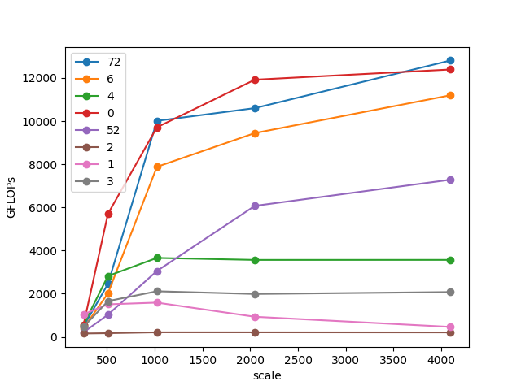

# Learn to optimize matmul kernel

Tested on a V100 (max 14TFLOPS)


## Usage
```python
# we bind all kernels to pytorch interface
pip install ./matmul

# test a single kernel, e.g., v52
python test.py 52

# test all and plot
bash runall.sh
```

* v0: `torch.matmul`, reference.
* v1: naive matmul with 1D linear kernel.
    > 1D kernel is actually good at small scale.
* v11: v1 with less blockDim.
* v2: naive matmul with 2D kernel.
* v21: v2 with less blockDim.
* v3: v2 + global memory coalescing.
    > only swapping the loop indices can result in 10x acceleration from v2.
* v4: v3 + block tiling with shared memory.
* v5: v4 + thread tiling.
* v51: v5 + register pre-fetch.
* v52: v51 + transpose trick.
* v6: v52 + float4 vectorize.
* v7: v6 + double buffering. (do...while impl)
* v71: v6 + double buffering w/o pragma unroll. (for impl)
    > without unrolling loops the speed is very slow...
* v72: v6 + double buffering w pragma unroll. (for impl)


## TODO:
* learn to use profiler
* learn CUTLASS
* FP16 with Tensor Cores


## References
* Great blog and illustrations: https://siboehm.com/articles/22/CUDA-MMM
* Reference repo: https://github.com/siboehm/SGEMM_CUDA
* Reference repo: https://github.com/wangzyon/NVIDIA_SGEMM_PRACTICE